# 📚 Kütüphane & Haber Blog

Next.js tabanlı, yönetim panelli bir kütüphane içerik platformu.  
İçerik, duyuru, yorum ve moderasyon akışlarını tek panelden yönetmek için geliştirilmiştir.

## İçindekiler

- [Ekran Görüntüleri](#-ekran-görüntüleri)
- [Özellikler](#-özellikler)
- [Teknoloji Yığını](#-teknoloji-yığını)
- [Kurulum](#-kurulum)
- [Kullanılabilir Scriptler](#-kullanılabilir-scriptler)
- [Yönetim Paneli](#-yönetim-paneli)
- [Yorum ve Moderasyon Mantığı](#-yorum-ve-moderasyon-mantığı)
- [Güvenlik](#-güvenlik)
- [Veritabanı Modelleri](#-veritabanı-modelleri)
- [Deployment](#-deployment)
- [Sorun Giderme](#-sorun-giderme)

---

## 📸 Ekran Görüntüleri

### Anasayfa


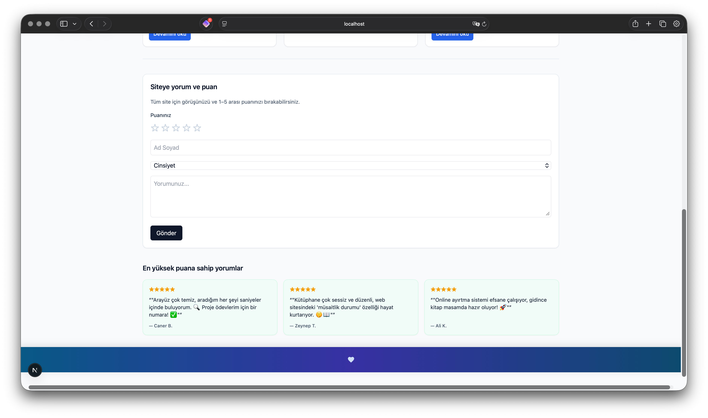

### İçerikler
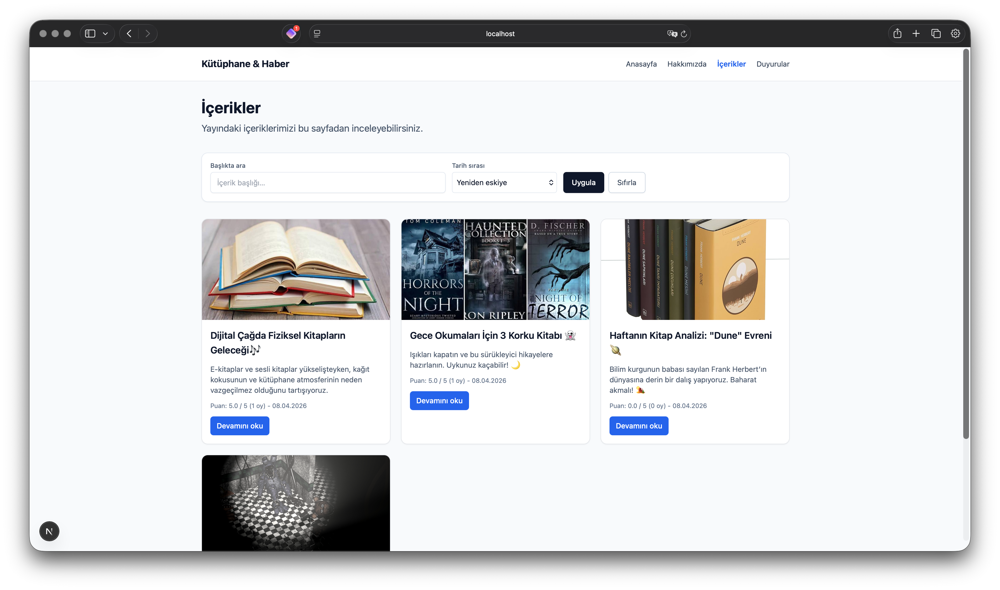

### Duyurular
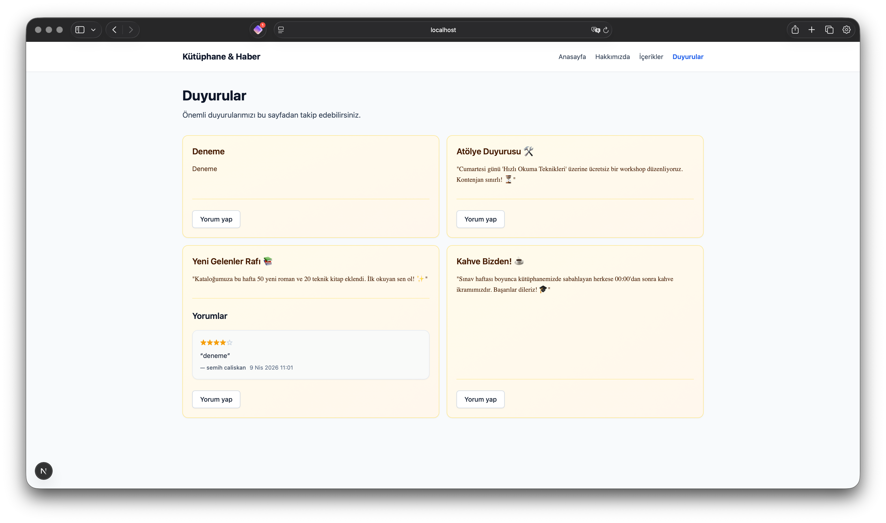

### Hakkımızda
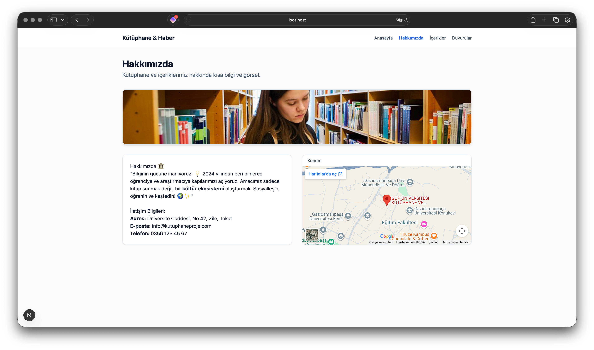

### Yönetim Paneli — Özet
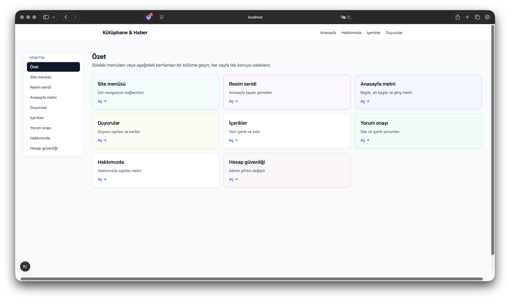

### Yönetim Paneli — İçerikler
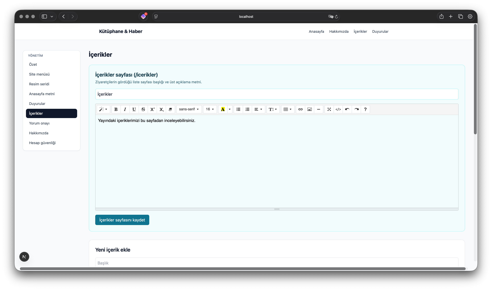

### Yönetim Paneli — Duyurular
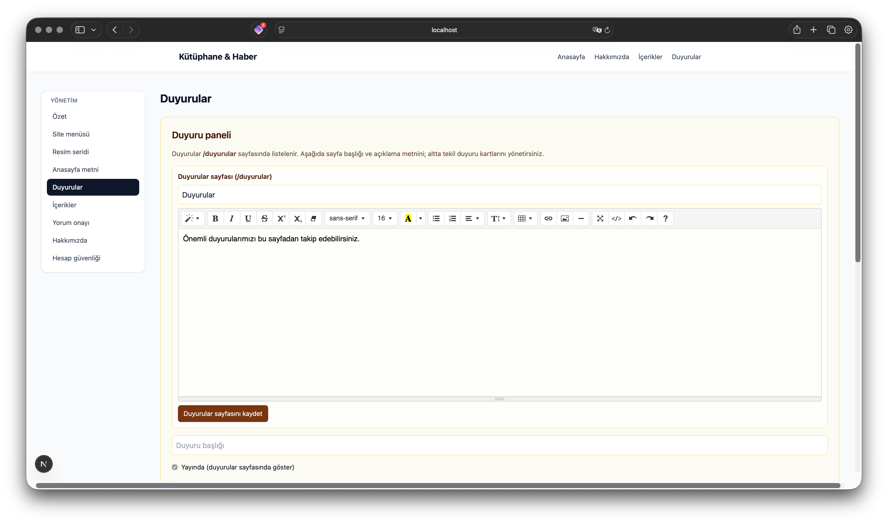

### Yönetim Paneli — Hakkımızda
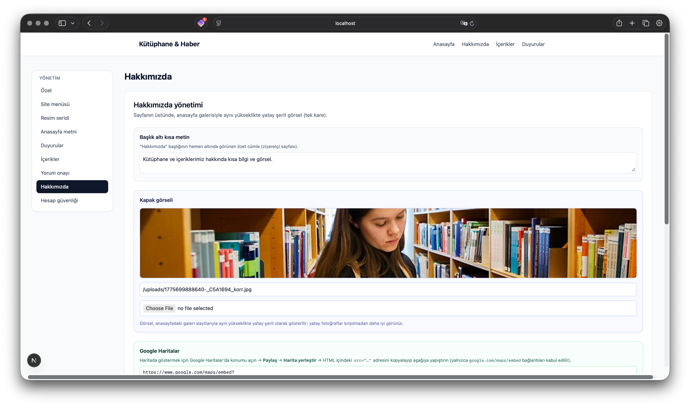

### Yönetim Paneli — Anasayfa Metni
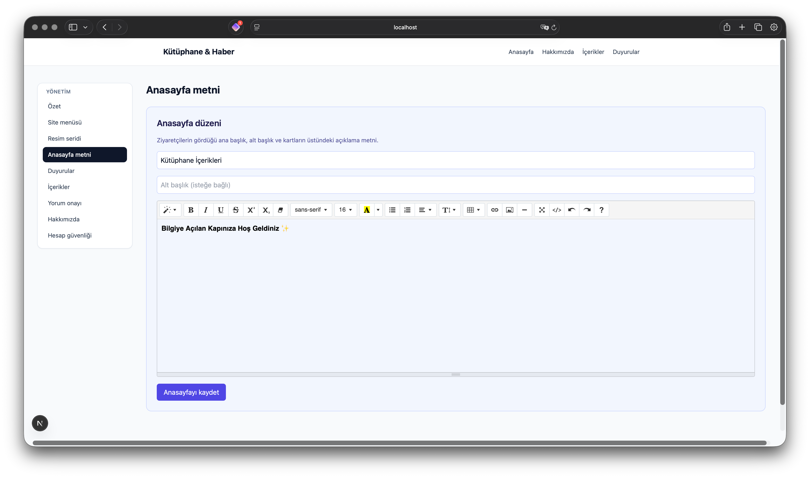

### Yönetim Paneli — Resim Seridi
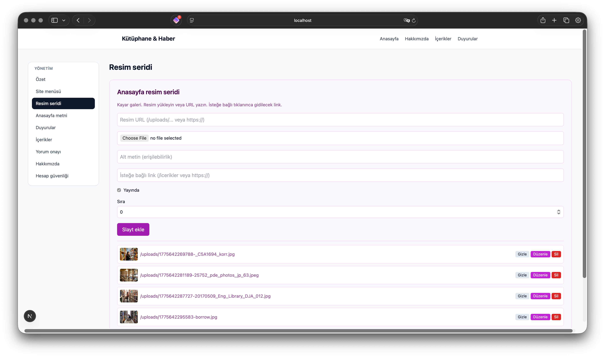

### Yönetim Paneli — Site Menüsü
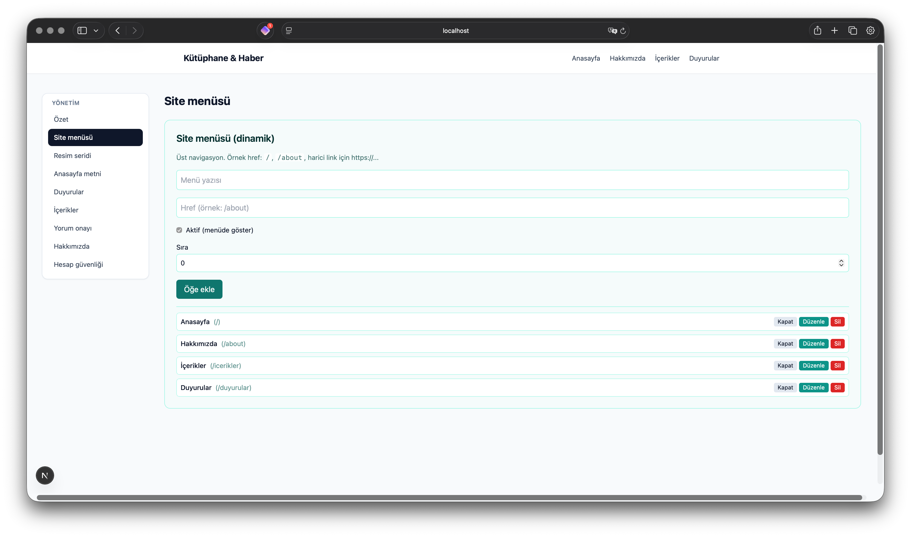

### Yönetim Paneli — Yorum Onayı
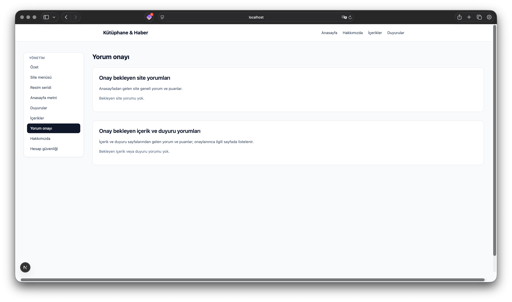

### Yönetim Paneli — Hesap Güvenliği
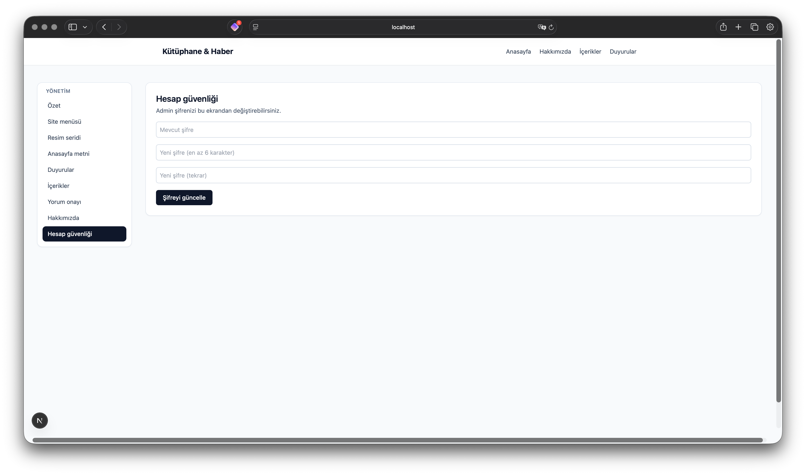

---

## ✨ Özellikler

### 📄 İçerik Yönetimi
- İçerik ekleme, düzenleme ve silme (CRUD)
- SEO uyumlu otomatik `slug` üretimi
- Kapak görseli yükleme
- Rich text düzenleme (Summernote Lite)
- 1–5 yıldız puanlama (AJAX, sayfa yenilemeden)
- Başlıkla arama ve tarihe göre sıralama

### 📢 Duyuru Yönetimi
- Duyuru ekleme, düzenleme ve silme (CRUD)
- Aktif/pasif durumu
- Sıralama desteği
- Duyurular sayfası başlık ve giriş metni yönetimi

### 💬 Yorum ve Moderasyon
- İçerik ve duyuru yorumları (onay mekanizmalı)
- Site geneli ziyaretçi yorumları ve puanlaması
- Onaylanmayan yorumlar public sayfada gösterilmez
- Admin panelinden tek tıkla onay veya red

### 🖼️ Anasayfa Yönetimi
- Kayan görsel galerisi (carousel) yönetimi
- Görsel ekleme, sıralama, aktif/pasif durumu
- Anasayfa başlık ve giriş metni yönetimi

### 🧭 Menü Yönetimi
- Navigasyon bağlantılarını yönetme
- Sıralama ve aktif/pasif durumu

### 📋 Hakkımızda Sayfası
- Başlık ve gövde metni yönetimi
- Kapak görseli yükleme
- Google Maps embed desteği

### 🔐 Hesap Güvenliği
- Admin şifresi panelden değiştirme
- Mevcut şifre doğrulaması zorunlu
- bcrypt ile şifre hashleme

### 📤 Görsel Yükleme
- Görsel yükleme API'si (`/api/admin/upload`)
- Yüklenen görseller `public/uploads/` altında saklanır

---

## 🔧 Teknoloji Yığını

### Framework ve Dil
- **Next.js 15** (App Router)
- **React 19**
- **TypeScript**

### Veritabanı
- **Prisma ORM** - Veritabanı erişimi
- **SQLite** - Yerel veritabanı

### Stil
- **Tailwind CSS** - Utility-first CSS framework

### Kütüphaneler
- **bcryptjs** - Şifre hashleme
- **jose** - JWT token üretimi ve doğrulama
- **slugify** - SEO uyumlu URL slug üretimi
- **sanitize-html** - XSS koruması için HTML sanitizasyonu
- **zod** - API katmanında şema doğrulama

---

## 📦 Kurulum

### Gereksinimler

- **Node.js** 18 veya üzeri
- **npm**

### Adımlar

#### 1) Projeyi klonla

```bash
git clone https://github.com/bukkitcraft/kutuphanewebsite.git
cd kutuphanewebsite
```

#### 2) Ortam değişkenlerini oluştur

```bash
cp .env.example .env
```

`.env` dosyasındaki değerleri düzenle:

```env
DATABASE_URL="file:./dev.db"
ADMIN_USERNAME="admin"       # Seed ile oluşturulacak admin kullanıcı adı
ADMIN_PASSWORD="123"         # Seed ile oluşturulacak admin şifresi
JWT_SECRET="guclu-bir-deger" # Güçlü rastgele bir değerle değiştir
```

#### 3) Bağımlılıkları yükle

```bash
npm install
```

#### 4) Veritabanını hazırla

```bash
npx prisma db push
npm run prisma:seed-admin
```

#### 5) Geliştirme sunucusunu başlat

```bash
npm run dev
```

Uygulama `http://localhost:3000` adresinde açılır.

### Varsayılan Giriş Bilgileri

Admin giriş sayfası: `http://localhost:3000/admin/login`

- **Kullanıcı adı:** `admin`
- **Şifre:** `123`

> ⚠️ Canlı ortamda mutlaka şifreyi panelden değiştirin.

---

## 📋 Kullanılabilir Scriptler

```bash
npm run dev               # Geliştirme sunucusunu başlat
npm run build             # Production build al
npm run start             # Production sunucusunu başlat
npm run lint              # Lint kontrolü yap
npm run prisma:generate   # Prisma client oluştur
npm run prisma:migrate    # Migration çalıştır
npm run prisma:seed-admin # İlk admin kullanıcısını oluştur
```

> `npm run dev` ve `npm run build` komutlarından önce otomatik olarak `prisma generate` çalışır.

---

## 💻 Yönetim Paneli

| Sayfa | URL |
|-------|-----|
| Giriş | `/admin/login` |
| Özet (Dashboard) | `/admin/dashboard` |
| İçerik yönetimi | `/admin/content` |
| Duyuru yönetimi | `/admin/announcements` |
| Resim seridi | `/admin/carousel` |
| Menü yönetimi | `/admin/menu` |
| Anasayfa ayarları | `/admin/homepage` |
| Hakkımızda yönetimi | `/admin/about` |
| Yorum moderasyonu | `/admin/moderation` |
| Hesap güvenliği | `/admin/account` |

---

## 💬 Yorum ve Moderasyon Mantığı

- Kullanıcı yorumları ilk etapta **onaysız** kaydedilir.
- Onaylanmayan yorumlar public sayfalarda gösterilmez.
- Admin, moderasyon panelinden yorumları onaylar veya reddeder.
- Duyurular için yorum formu varsayılan olarak gizlidir; kullanıcı "Yorum yap" butonuyla açar.
- Site geneli ziyaretçi yorumları da aynı onay mekanizmasına tabidir.

---

## 🔐 Güvenlik

- HTML içerikler `sanitize-html` ile sanitize edilerek saklanır.
- API katmanında `zod` ile tip ve şema doğrulaması yapılır.
- Admin alanı middleware ile JWT token doğrulamasıyla korunur.
- Şifreler `bcryptjs` ile hashlenerek veritabanında saklanır.

---

## 💾 Veritabanı Modelleri

| Model | Açıklama |
|-------|----------|
| `Content` | İçerikler (blog yazıları) |
| `Announcement` | Duyurular |
| `Comment` | İçerik ve duyuru yorumları |
| `SiteReview` | Site geneli ziyaretçi yorumları |
| `AdminUser` | Admin kullanıcısı |
| `MenuItem` | Navigasyon menü öğeleri |
| `HomeCarouselSlide` | Anasayfa kayan görseller |
| `Setting` | Site geneli ayarlar (anahtar-değer) |

---

## 🚀 Deployment

Production ortamında `.env` dosyasındaki şu değerleri güncelle:

```env
DATABASE_URL="file:./prod.db"
JWT_SECRET="guclu-rastgele-bir-deger"
```

> `ADMIN_USERNAME` ve `ADMIN_PASSWORD` yalnızca `prisma:seed-admin` scripti çalıştırılırken kullanılır. Kurulum sonrası şifreyi admin panelinden değiştir.

SQLite yerine PostgreSQL'e geçmek için `prisma/schema.prisma` dosyasındaki `datasource` bloğunu güncelle:

```prisma
datasource db {
  provider = "postgresql"
  url      = env("DATABASE_URL")
}
```

---

## 🔍 Sorun Giderme

### `.next` cache kaynaklı modül hataları

Hata: `Cannot find module './xxxx.js'`

```bash
rm -rf .next
npm run dev
```

### Prisma şema değişikliği sonrası alan bulunamıyor

```bash
npx prisma db push
npm run prisma:generate
npm run dev
```
